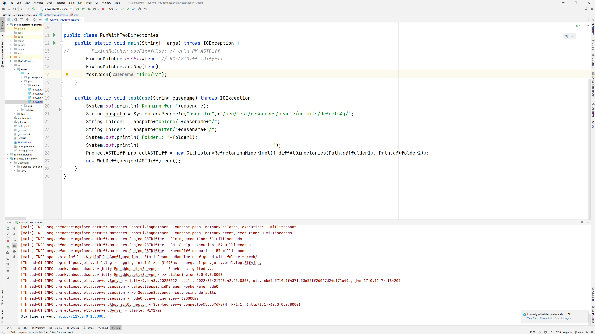
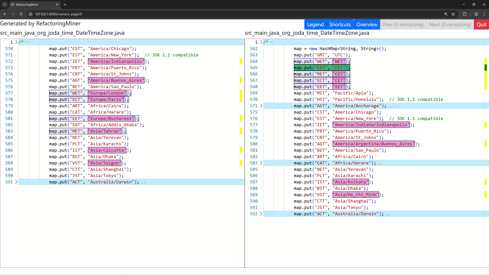
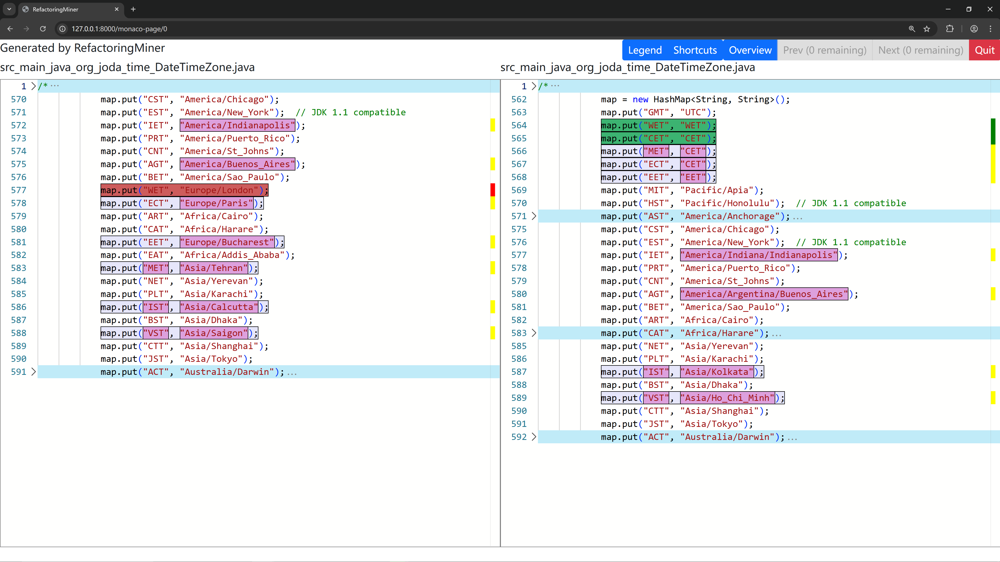

# How to run DiffFix

1. unzip `./out.zip`  (compressed to reduce the file size)
2. install `JDK 17` and `Gradle 7.4`
3. open the project in `IntelliJ IDEA`
4. config the version of JDK and Gradle
5. load project dependences
6. open `src/main/java/gui/RunWithTwoDirectories.java`
7. build the project `./gradlew build`
8. run the `main` method





**The diff fixed by DiffFix**



**The diff generated by RM-ASTDiff**




# How to use DiffFix

```java
import org.refactoringminer.astDiff.matchers.FixingMatcher;

// public void match( Tree src, Tree dst, ExtendedMultiMappingStore mappingStore )
// ...
new FixingMatcher().match(srcRoot, dstRoot, mappingStore);
// check the source code for more details
// start from src/main/java/org/refactoringminer/astDiff/matchers/FixingMatcher.java
```

